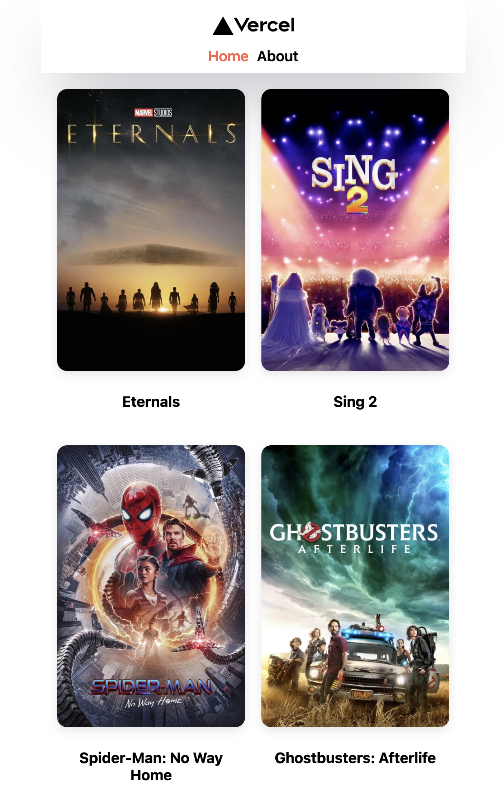

# Next.JS Movie Info

## 프로젝트 내용

Next.js 기반으로 "The Movie Database" 사이트의 API를 연동하여 영화 정보를 연동하는 사이트입니다.

- Home 메뉴에서는 최신 트렌드 영화 Top10 목록을 볼 수 있습니다.

- Next.js 스터디를 위하여 개인적으로 만든 프로그램입니다.

## 주요 기능

- Next.js 기반 소스 구성
- SSR 기반 화면 구성
- Backend에서 영화 API 연동 기능

## 스크린샷

